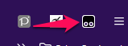
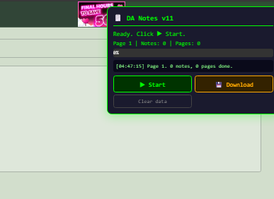

  
  <!-- REPLACE: Create a banner image (suggested: 700x200, dark bg, "DA Notes Scraper v11" text with green accent) -->

<h1 align="center">DA Notes Scraper v11</h1>

  <strong>Archive your entire DeviantArt Notes inbox as beautiful, readable conversation files — before they're gone forever.</strong>

  
  
  
  

  <a href="#-features">Features</a> •
  <a href="#-installation">Installation</a> •
  <a href="#-usage">Usage</a> •
  <a href="#-viewing-your-archive">Viewing</a> •
  <a href="#-troubleshooting">Troubleshooting</a> •
  <a href="#-how-it-works">How It Works</a>

---

## ✨ Features

- **Full conversation reconstruction** — rebuilds the back-and-forth from DA's messy quoted-reply format
- **Both sides preserved** — your sent messages are extracted from quoted replies
- **Clickable links** — real URLs restored from HTML, not truncated `www.deviantart.com/...` display text
- **Deduplication** — DA quotes the entire thread in every reply; this strips all that out
- **Dual themes** — Modern Dark (default) and Nostalgia Light (classic 2008-era DA olive/cream)
- **International dates** — "5th September 2025" format
- **Auto-resume** — close your browser, come back tomorrow, it picks up where it left off
- **One file per contact** — self-contained HTML files you can view offline forever
- **100% local** — nothing is sent anywhere, all data stays on your computer

  
  <!-- REPLACE: Screenshot of an archive file open in browser, dark theme, showing a conversation -->

  
  <!-- REPLACE: Screenshot of the same file in Nostalgia Light theme -->

---

## 📦 Installation

### Step 1 — Install Tampermonkey

Tampermonkey is a free browser extension that runs userscripts on websites.

1. Go to **[tampermonkey.net](https://www.tampermonkey.net/)**
2. Click the download link for your browser (Chrome / Firefox / Edge)
3. Click **"Add to Chrome"** (or equivalent) and confirm permissions
4. You should see a **black square icon** in your browser toolbar

  
  <!-- REPLACE: Screenshot of browser toolbar showing the Tampermonkey icon -->

### Step 2 — Install the Script

1. Click the **Tampermonkey icon** in your toolbar → **Dashboard**
2. Click the **`+` tab** (Create a new script)

  
  <!-- REPLACE: Screenshot of the Tampermonkey Dashboard with the + tab highlighted -->

3. **Select all** the template code and **delete it** (`Ctrl+A` → `Delete`)
4. Open **`da-notes-scraper.user.js`** in any text editor
5. **Copy the entire file** (`Ctrl+A` → `Ctrl+C`)
6. **Paste** into the Tampermonkey editor (`Ctrl+V`)
7. **Save** with `Ctrl+S`

  
  <!-- REPLACE: Screenshot of the Tampermonkey editor with the script pasted, showing the header -->

### Step 3 — Verify

Click the Tampermonkey icon. You should see **"DeviantArt Notes Scraper v11"** listed and enabled (green toggle).

  
  <!-- REPLACE: Screenshot of the Tampermonkey dropdown with the script listed -->

---

## 🚀 Usage

### Open Your Notes

1. Go to **[deviantart.com/messages/notes](https://www.deviantart.com/messages/notes)**
2. Make sure you're **logged in**
3. Wait 2–3 seconds — the **scraper panel** appears in the top-right corner

  
  <!-- REPLACE: Screenshot of the DA Notes page with the green scraper panel visible in the top-right -->

### The Control Panel

| Button | What it does |
|--------|-------------|
| **▶ Start** | Begins scraping from the current page |
| **⏹ Stop** | Pauses scraping — progress is saved |
| **💾 Download** | Generates and downloads your archive files |
| **Clear data** | Deletes all saved data (**cannot be undone**) |

### Start Scraping

1. Click **▶ Start**
2. Watch the log — it shows each note being captured in real time
3. When a page is done, it **auto-navigates** to the next page
4. The page reloads (this is normal) — the script auto-resumes after 3 seconds

  
  <!-- REPLACE: Screenshot of the panel while actively scraping, showing log entries and progress bar -->

> [!TIP]
> **You can close your browser and come back later.** Progress is saved. Just navigate back to your Notes page and the scraper auto-resumes.

> [!WARNING]
> **Don't click notes manually** while the scraper is running — it'll interfere with the click sequence. Other tabs and windows are fine.

### Time Estimates

| Inbox size | Estimated time |
|-----------|---------------|
| 10 pages (~250 notes) | ~20 minutes |
| 50 pages (~1,250 notes) | ~1.5 hours |
| 200 pages (~5,000 notes) | ~6 hours |
| 400 pages (~10,000 notes) | ~12 hours |

### Download Your Archive

Click **💾 Download** at any time (you don't have to wait for the full scrape to finish).

Your browser may ask to allow multiple downloads — click **Allow**.

| File | Description |
|------|-------------|
| `da-notes_Username.html` | One file per contact — all conversations, styled and readable |
| `da-notes-summary.csv` | Spreadsheet summary of contacts, threads, and note counts |
| `da-notes-backup.json` | Raw JSON backup of all scraped data |

  
  <!-- REPLACE: Screenshot of the Downloads folder showing the HTML, CSV, and JSON files -->

---

## 👀 Viewing Your Archive

1. **Double-click** any `da-notes_Username.html` file — it opens in your browser
2. Files are **completely self-contained** — no internet needed, no dependencies
3. Click the **theme button** in the subheader to switch between Dark and Light

  
  <!-- REPLACE: Screenshot zoomed in on the subheader bar showing the theme toggle button -->

### What's Inside Each File

| Element | Description |
|---------|-------------|
| **Thread boxes** | Conversations grouped by subject line |
| **Messages** | Chronological order — oldest at top, newest at bottom |
| **Sender names** | Color-coded — your messages vs. theirs |
| **Dates** | International format: "5th September 2025" |
| **Links** | Real, clickable URLs |
| **Raw data** | Expandable toggle at the bottom of each thread for verification |

---

## 🔧 Troubleshooting

<strong>Panel doesn't appear</strong>

- Make sure Tampermonkey is **enabled** (click icon → check toggle)
- Make sure the script is **enabled** (Dashboard → green toggle)
- Make sure you're on `deviantart.com/messages/notes`
- Try a hard refresh: `Ctrl+Shift+R`

<strong>Scraper gets stuck or panel disappears after navigation</strong>

1. Click **⏹ Stop**
2. Manually go to `deviantart.com/messages/notes?folder_id=1&page=1`
3. Wait for the panel to appear
4. Click **▶ Start** — it'll skip already-completed pages

<strong>"No notes on this page" error</strong>

DA may have updated their page structure. Open DevTools (`F12`), inspect a note in the left panel, and check if `<li>` elements still use the class `HWjiVP`. If the class name has changed, the selector in the script needs to be updated.

<strong>Storage full warning</strong>

Tampermonkey has storage limits (~5–10 MB). For very large inboxes, scrape in batches: do ~50 pages, download, clear data, continue. The JSON backups can be merged later.

<strong>Browser blocks multiple downloads</strong>

Look for a notification in the address bar asking to allow multiple downloads. Click Allow and try 💾 Download again.

<strong>Missing or duplicated messages</strong>

Thread reconstruction depends on detecting username patterns in the text. Unusual formatting can cause imperfect splitting. Check the **"View raw scraped data"** toggle at the bottom of each thread to see what was captured.

---

## 🧠 How It Works

### The Problem

DA Notes work like email — every reply quotes the entire previous conversation. A 20-message thread means note #20 contains all 20 messages, note #19 has 19, etc. Your sent messages only exist as quoted text inside the other person's replies. Without reconstruction, you'd see massive duplication and lose half the conversation.

### Scraping

The script clicks each note in the inbox list, waits for the detail panel to load, captures the full HTML (preserving real link URLs) and plain text (for deduplication), stores everything in Tampermonkey's local storage, and auto-navigates between pages.

### Thread Reconstruction

1. Notes are grouped by contact and subject (stripping "Re:" prefixes)
2. The **longest note** in each thread contains the most complete conversation
3. Full text is split into individual messages using **username patterns** as boundaries
4. Messages are **reversed** to chronological order (DA shows newest-first)
5. Duplicate text is removed by fingerprinting
6. Dates are extracted from the text or backfilled from note metadata

### Link Restoration

DA's text view truncates URLs to `www.deviantart.com/user/...` — but the HTML `href` still has the full URL. The scraper extracts every link from the HTML, builds a lookup table, and replaces truncated display text with real URLs.

---

## 🔒 Data & Privacy

| Question | Answer |
|----------|--------|
| Where is data stored? | Tampermonkey's local storage in your browser, then as files in your Downloads folder |
| Is anything sent online? | **No.** Zero network requests. The script only reads DA pages you're already viewing |
| Can I delete all data? | Yes — click **Clear data**, or uninstall the script |
| Where does the script run? | Only on `deviantart.com/messages/notes` — does nothing on any other site |

---

## 📝 Updating

If you get a new version:

1. Tampermonkey icon → **Dashboard**
2. Click **DeviantArt Notes Scraper v11** to open the editor
3. Select all (`Ctrl+A`) → Delete → Paste new code → Save (`Ctrl+S`)
4. Refresh your DA Notes page

> [!NOTE]
> v11 uses storage key `db9`. Your existing scraped data is preserved across updates that use the same key.

---

## 📄 License

MIT — do whatever you want with it.

---

  Made for preserving what matters.

